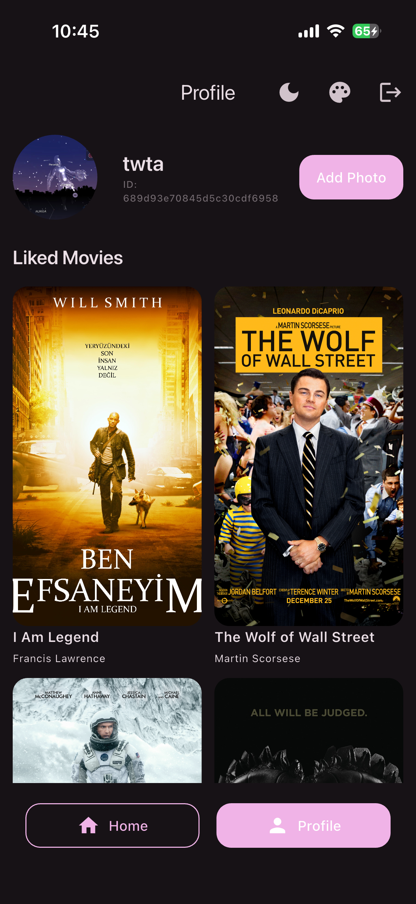
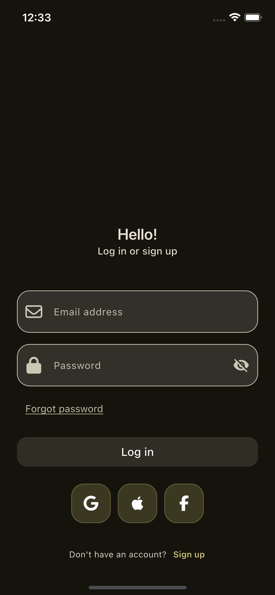
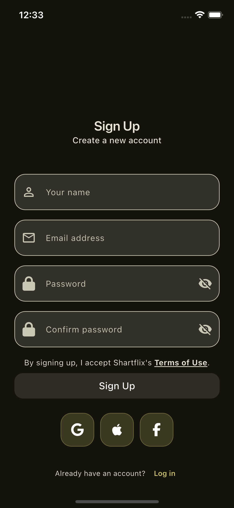
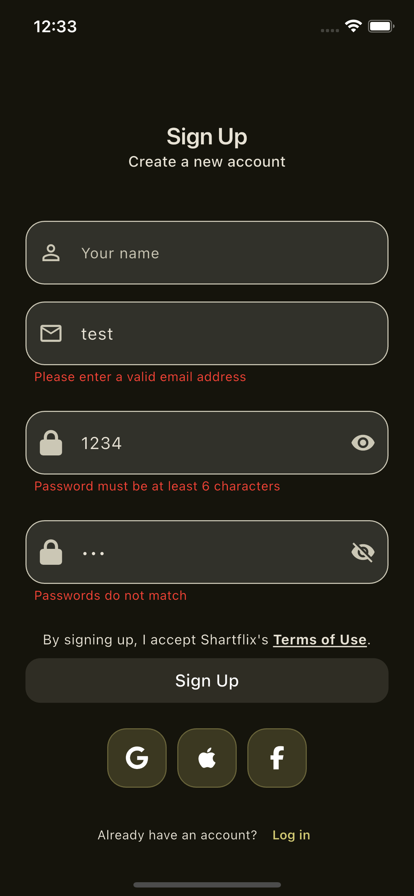
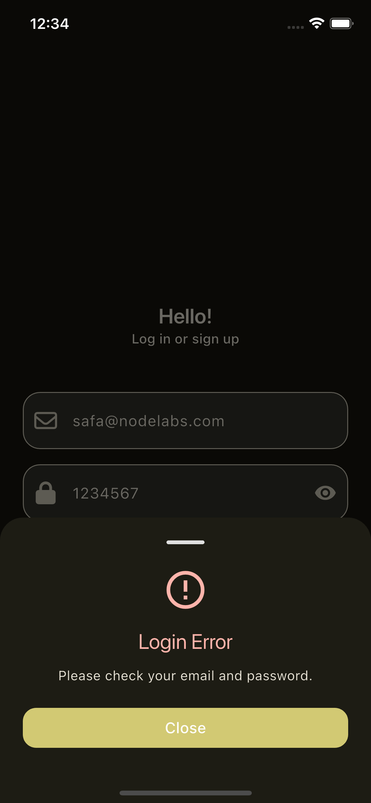
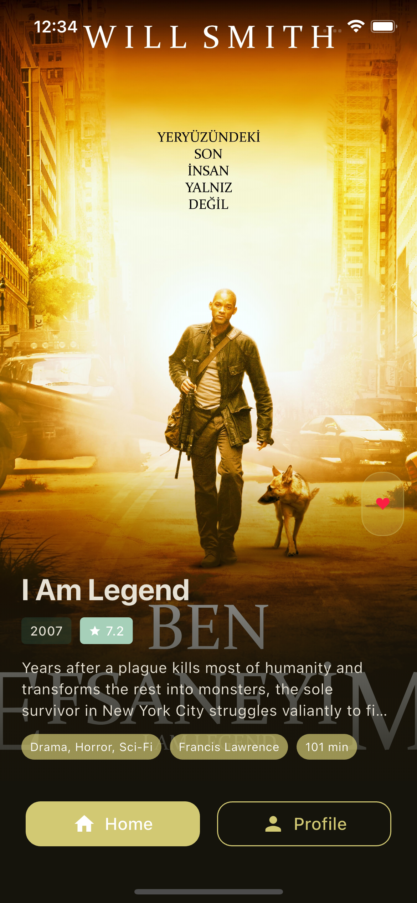

# shartflix

Shartflix is a movie app.

To learn more about the technologies and implementation techniques used in this project, see [Study Case Techniques](STUDY_CASE_TECHNIQUES.md).

## Getting Started

1. Install Flutter: https://docs.flutter.dev/get-started/install
2. Clone this repository:
   ```sh
   git clone <repo-url>
   cd shartflix
   ```
3. Get dependencies:
   ```sh
   flutter pub get
   ```
4. Run the app:
   ```sh
   flutter run
   ```

---

## App Start Requirements

Before running the app, you need to set up environment variables:

1. Create a `.env` file in the project root directory.
2. Add the following line to your `.env` file, replacing the URL with your backend API endpoint:
   ```env
   BASE_URL=https://your-api-url.com
   ```

> **Note:** The app will not work properly without a valid `BASE_URL` defined in the `.env` file.

---

## Asset Management & Automation

### 1. Automatic Asset Scaling (asset_resizer.dart)

To automatically generate asset files for different resolutions (1.5x, 2.0x, 3.0x, 4.0x), use the
`asset_resizer.dart` script.

#### Usage:

1. Add your original image(s) to the `assets/images/` folder (e.g., `logo.png`).
2. Install dependencies:
   ```sh
   flutter pub get
   ```
3. Run the script:
   ```sh
   dart run asset_resizer.dart
   ```
4. The script will automatically generate resized images in `assets/images/1.5x/`, `2.0x/`, `3.0x/`,
   and `4.0x/` folders.

> **Note:** You can adjust the scales in the `scales` constant inside `asset_resizer.dart`.

---

### 2. Asset & Font Automation (flutter_gen & build_runner)

Use [flutter_gen](https://pub.dev/packages/flutter_gen) to safely and automatically generate Dart
code for your asset and font paths.

#### Setup & Usage:

1. Make sure your `pubspec.yaml` includes the following:
   ```yaml
   dev_dependencies:
     flutter_gen_runner: ^5.4.0
     build_runner: ^2.4.9
     image: ^4.1.7

   flutter_gen:
     output: lib/const/assets/gen/
     integrations:
       flutter_svg: true
   ```
2. Define your assets and fonts in `pubspec.yaml` as usual.
3. Run the following command to generate the Dart code:
   ```sh
   flutter pub run build_runner build --delete-conflicting-outputs
   ```
4. Use your assets and fonts in Dart code like this:
   ```dart
   import 'const/assets/gen/assets.gen.dart';
   Image.asset(Assets.images.logo.path);

   import 'const/assets/gen/fonts.gen.dart';
   Text('Hello', style: TextStyle(fontFamily: FontFamily.schyler));
   ```

---

### Extra Notes

- After adding or removing assets, it is recommended to re-run both the `asset_resizer.dart` script
  and the build_runner command.
- This automation eliminates typos in asset paths and provides autocomplete support in your IDE.

---

<p align="center">
  
  
  
</p>

<p align="center">
  
  
  
  
</p>